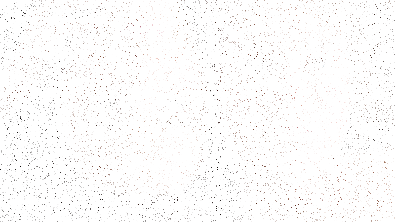
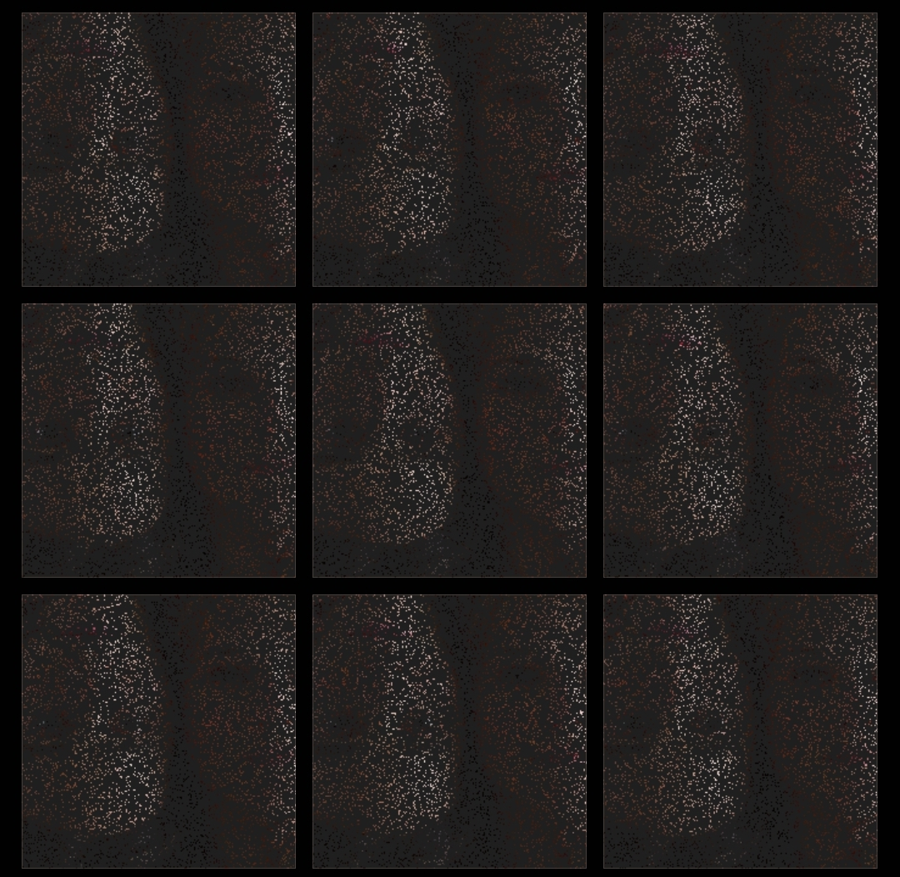

# Welcome to Image Splitter

Image Splitter is a simple tool that allows you to split an image into multiple smaller images, each containing unique random pixels from the original image. This project includes two Python scripts: `split.py` and `merge.py`.

## Requirements

To run this tool, you need to have the following libraries installed:

- PIL (Python Imaging Library)
- argparse
- numpy

You can install them by running the following command:

```
pip install pillow argparse numpy
```

## Usage

### Splitting an Image

To split an image, run the following command:

```
python split.py -n <number_of_images> -path <path_to_image>
```

Or you can simply use; 

```
python split.py
```

By default, `number_of_images` is set to 100 and `path_to_image` is set to `image.jpg`. The split images will be saved in the `pixels/` folder.

### Merging Images

To merge the split images back into the original image, run the following command:

```
python merge.py
```

The merged image will be saved as `final.png`.

## Example
### The original image;
 
### Will turn into something like this;
 
(splitted into 100 fragments)

 
(splitted into 10 fragments)

## Disclaimer

This tool is for educational and personal use only. The creator is not responsible for any misuse or damage caused by this tool.
